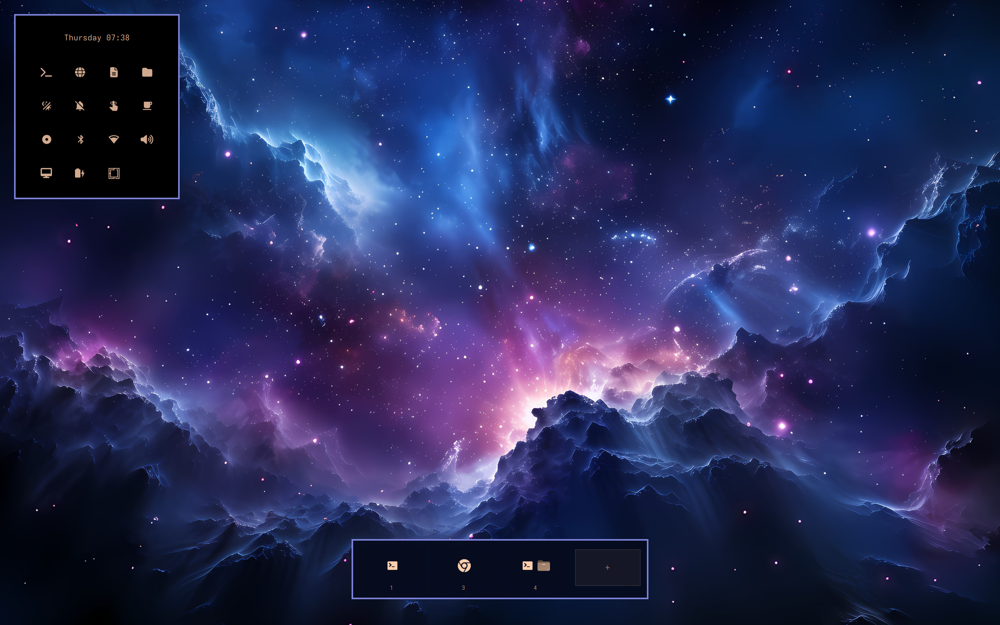

# 🗣️ Speaker Corners

> One corner. One lightweight, fully click-through Omarchy plugin.
> A hot corner that **speaks** — and a floating workspace switcher that listens.

**Speaker Corners** puts a floating workspace switcher (bottom-right) behind a
single hot corner in a masked, click-through overlay. No window stack, no
bloat — one surface, `~1.5 KB` of attitude.



---

## 🎯 What it does

- **🖱️ Bottom-right hot corner** — park the cursor, let a tiny dwell timer
  fire: toggle the workspace floating strip, or run your own command.
  Everything else stays fully click-through.
- **🌆 Floating workspace strip (bottom-right)** — hover and wander between
  workspaces. Each card shows a live preview with app icons resolved straight
  from your desktop entries, an urgent dot, and a `+` to mint a new workspace.

---

## 📦 Installation

```sh
omarchy plugin add https://github.com/maiosx/workspace-switcher.git --enable
omarchy restart shell
```

## Removal
omarchy plugin remove maiosx.workspaceswitcher

## ⚙️ Configuration

Settings live in the `workspaceswitcher` entry of
`~/.config/omarchy/shell.json`, for example:

```jsonc
{
  "id": "maiosx.workspaceswitcher",
  "enabled": true,
  "dwellMs": 139,          // how long the pointer must rest to fire (120–3000)
  "targetSize": 8,         // hot-corner hitbox, in px
  "bottomRightAction": "command",
  "bottomRightCommand": "omarchy-shell workspace-overview toggle"
}
```

### Corner action

| Key                  | values                                           |
| -------------------- | ------------------------------------------------- |
| `bottomRightAction`  | `command` / `none` — workspace strip by default    |

`bottomRightCommand` runs via `bash -lc`, so `omarchy-*` helpers and your
shell niceties are all fair game.

---

## 🦾 Requirements

- **Omarchy** (shell + `omarchy-shell` IPC)
- **Hyprland** (native `WlrLayershell` + Hyprland IPC)
- A **Nerd Font** on the system (default: `JetBrainsMono Nerd Font`) for all the
  fancy glyphs

## 🧱 Roof tiles

- `Speakercorners.qml` — the whole single-surface overlay
- `IconModel.js` — app icon resolution for the workspace cards (a faithful
  subset of Omarchy's HUD model)
- `Workspaces.js` — Hyprland → plain-JS workspace model builder

## 🚗 License

MIT — go ahead, remix the corner. 🛹
